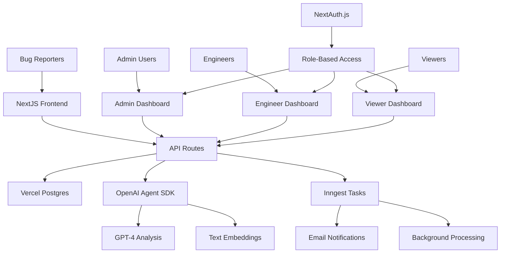

# BugFlow - Technical Architecture

## System Overview

BugFlow is an automated bug bounty report management application built with NextJS, OpenAI Agent SDK, Inngest, and deployed on Vercel. The system processes incoming bug reports, uses AI for analysis and duplicate detection, and provides role-based dashboards for management.

## Architecture Diagram



## Tech Stack

### Frontend
- **NextJS 14+** with App Router
- **TypeScript** for type safety
- **Tailwind CSS** for styling
- **React Hook Form** for form validation
- **NextAuth.js** for authentication
- **Shadcn/ui** for UI components

### Backend
- **NextJS API Routes** for server-side logic
- **Vercel Postgres** for data storage
- **OpenAI Agent SDK** for AI processing
- **Inngest** for background tasks
- **Uploadthing** for file uploads

### AI & Processing
- **OpenAI GPT-4** for report analysis
- **OpenAI Embeddings** for semantic similarity
- **Vector similarity search** for duplicate detection

### Deployment
- **Vercel** for hosting and deployment
- **Vercel Edge Functions** for performance
- **Vercel KV** for caching (optional)

## Database Schema

### Users Table
```sql
CREATE TABLE users (
  id UUID PRIMARY KEY DEFAULT gen_random_uuid(),
  email VARCHAR(255) UNIQUE NOT NULL,
  name VARCHAR(255) NOT NULL,
  role VARCHAR(50) NOT NULL CHECK (role IN ('admin', 'engineer', 'viewer')),
  team VARCHAR(100),
  created_at TIMESTAMP DEFAULT NOW(),
  updated_at TIMESTAMP DEFAULT NOW()
);
```

### Reports Table
```sql
CREATE TABLE reports (
  id UUID PRIMARY KEY DEFAULT gen_random_uuid(),
  reporter_name VARCHAR(255),
  reporter_email VARCHAR(255),
  title VARCHAR(500) NOT NULL,
  description TEXT NOT NULL,
  affected_system VARCHAR(255),
  severity VARCHAR(20) CHECK (severity IN ('low', 'medium', 'high', 'critical')),
  bug_type VARCHAR(100),
  status VARCHAR(20) DEFAULT 'new' CHECK (status IN ('new', 'in_progress', 'resolved', 'duplicate', 'rejected')),
  assigned_engineer_id UUID REFERENCES users(id),
  duplicate_of UUID REFERENCES reports(id),
  ai_analysis JSONB,
  embedding VECTOR(1536),
  file_urls TEXT[],
  created_at TIMESTAMP DEFAULT NOW(),
  updated_at TIMESTAMP DEFAULT NOW()
);
```

### Teams Table
```sql
CREATE TABLE teams (
  id UUID PRIMARY KEY DEFAULT gen_random_uuid(),
  name VARCHAR(100) NOT NULL,
  description TEXT,
  bug_types TEXT[],
  created_at TIMESTAMP DEFAULT NOW()
);
```

### Report_Comments Table
```sql
CREATE TABLE report_comments (
  id UUID PRIMARY KEY DEFAULT gen_random_uuid(),
  report_id UUID NOT NULL REFERENCES reports(id) ON DELETE CASCADE,
  user_id UUID NOT NULL REFERENCES users(id),
  comment TEXT NOT NULL,
  created_at TIMESTAMP DEFAULT NOW()
);
```

### Assignments Table
```sql
CREATE TABLE assignments (
  id UUID PRIMARY KEY DEFAULT gen_random_uuid(),
  report_id UUID NOT NULL REFERENCES reports(id) ON DELETE CASCADE,
  engineer_id UUID NOT NULL REFERENCES users(id),
  assigned_by UUID NOT NULL REFERENCES users(id),
  assigned_at TIMESTAMP DEFAULT NOW(),
  status VARCHAR(20) DEFAULT 'active' CHECK (status IN ('active', 'completed', 'reassigned'))
);
```

## API Routes Structure

### Public Routes
- `POST /api/reports/submit` - Submit new bug report
- `GET /api/reports/[id]/public` - Public report status (for reporters)

### Protected Routes (Authenticated)
- `GET /api/reports` - List reports (filtered by role)
- `GET /api/reports/[id]` - Get specific report
- `PUT /api/reports/[id]` - Update report
- `DELETE /api/reports/[id]` - Delete report (admin only)
- `POST /api/reports/[id]/assign` - Assign engineer
- `POST /api/reports/[id]/comments` - Add comment
- `GET /api/users` - List users (admin only)
- `POST /api/users` - Create user (admin only)
- `GET /api/teams` - List teams
- `POST /api/export/csv` - Export reports as CSV

### AI Processing Routes
- `POST /api/ai/analyze` - Analyze report with AI
- `POST /api/ai/check-duplicates` - Check for duplicates
- `POST /api/ai/classify` - Classify bug type and severity

## Authentication & Authorization

### Roles and Permissions

#### Admin Role
- Full access to all reports
- User management (create, edit, delete users)
- Team management
- System configuration
- Export functionality
- Manual override of AI decisions

#### Engineer Role
- View assigned reports
- Update report status
- Add comments to reports
- View team reports
- Limited export (own assignments)

#### Viewer Role
- Read-only access to reports
- View statistics and dashboards
- No editing capabilities
- Limited to specific teams (configurable)

### NextAuth.js Configuration
```typescript
// auth.config.ts
export const authConfig = {
  providers: [
    CredentialsProvider({
      // Email/password authentication
    }),
    // Optional: OAuth providers (Google, GitHub)
  ],
  callbacks: {
    jwt: ({ token, user }) => {
      if (user) {
        token.role = user.role;
        token.team = user.team;
      }
      return token;
    },
    session: ({ session, token }) => {
      session.user.role = token.role;
      session.user.team = token.team;
      return session;
    },
  },
};
```

## AI Processing Pipeline

### Report Analysis Flow
1. **Input Validation** - Sanitize and validate report data
2. **AI Analysis** - Use OpenAI Agent SDK to extract:
   - Bug type classification
   - Severity assessment
   - Affected system identification
   - Key technical details
3. **Embedding Generation** - Create vector embeddings for similarity search
4. **Duplicate Detection** - Compare against existing reports using cosine similarity
5. **Engineer Assignment** - Match bug type to appropriate team/engineer
6. **Notification** - Queue background task for notifications

### OpenAI Agent SDK Integration
```typescript
// ai/agent.ts
export class BugAnalysisAgent {
  async analyzeReport(report: ReportInput): Promise<AnalysisResult> {
    const analysis = await this.agent.run({
      messages: [
        {
          role: "system",
          content: ANALYSIS_PROMPT,
        },
        {
          role: "user",
          content: `Analyze this bug report: ${report.description}`,
        },
      ],
    });
    
    return {
      bugType: analysis.bugType,
      severity: analysis.severity,
      affectedSystem: analysis.affectedSystem,
      confidence: analysis.confidence,
    };
  }
  
  async checkDuplicates(report: ReportInput): Promise<DuplicateResult[]> {
    const embedding = await this.generateEmbedding(report.description);
    const similarReports = await this.findSimilarReports(embedding);
    
    return similarReports.filter(r => r.similarity > 0.85);
  }
}
```

## Background Tasks with Inngest

### Task Types
1. **Report Processing** - AI analysis and duplicate detection
2. **Email Notifications** - Notify engineers of assignments
3. **Periodic Cleanup** - Archive old reports, cleanup files
4. **Analytics Updates** - Update dashboard statistics

### Inngest Functions
```typescript
// inngest/functions.ts
export const processReport = inngest.createFunction(
  { id: "process-report" },
  { event: "report.submitted" },
  async ({ event, step }) => {
    const analysis = await step.run("analyze-report", () =>
      analyzeReport(event.data.reportId)
    );
    
    const duplicates = await step.run("check-duplicates", () =>
      checkDuplicates(event.data.reportId)
    );
    
    if (!duplicates.length) {
      await step.run("assign-engineer", () =>
        assignEngineer(event.data.reportId, analysis)
      );
      
      await step.run("send-notification", () =>
        sendNotification(event.data.reportId)
      );
    }
  }
);
```

## Security Considerations

### Input Validation
- Sanitize all user inputs to prevent XSS
- Validate file uploads (type, size, content)
- Rate limiting on API endpoints
- CSRF protection

### Data Protection
- Encrypt sensitive data at rest
- Use environment variables for secrets
- Implement proper session management
- Regular security audits

### API Security
- JWT token validation
- Role-based access control middleware
- Request logging and monitoring
- Error handling without information leakage

## Performance Optimization

### Caching Strategy
- Cache AI analysis results
- Cache user sessions
- Cache frequently accessed reports
- Use Vercel KV for fast lookups

### Database Optimization
- Proper indexing on frequently queried fields
- Vector index for embedding similarity search
- Connection pooling
- Query optimization

### Frontend Optimization
- Server-side rendering for public pages
- Static generation where possible
- Image optimization
- Code splitting and lazy loading

## Monitoring and Logging

### Application Monitoring
- Vercel Analytics for performance
- Error tracking with Sentry (optional)
- Custom metrics for AI accuracy
- User activity logging

### AI Performance Tracking
- Track AI analysis accuracy
- Monitor duplicate detection effectiveness
- Cost tracking for OpenAI API usage
- Response time monitoring

## Deployment Strategy

### Environment Configuration
```bash
# .env.local
NEXTAUTH_SECRET=your-secret
NEXTAUTH_URL=http://localhost:3000

DATABASE_URL=your-postgres-url
OPENAI_API_KEY=your-openai-key
INNGEST_EVENT_KEY=your-inngest-key
UPLOADTHING_SECRET=your-uploadthing-secret
```

### Vercel Deployment
1. Connect GitHub repository
2. Configure environment variables
3. Set up custom domain
4. Enable preview deployments
5. Configure edge functions

## Future Enhancements

### Phase 2 Features
- Email ingestion for report submissions
- Advanced analytics dashboard
- Integration with external tools (Jira, Slack)
- Mobile-responsive design improvements

### Phase 3 Features
- Machine learning model fine-tuning
- Advanced reporting and metrics
- API for third-party integrations
- Multi-tenant support

## Development Guidelines

### Code Standards
- Use TypeScript for all code
- Follow NextJS best practices
- Implement proper error boundaries
- Write comprehensive tests
- Document all API endpoints

### Testing Strategy
- Unit tests for utility functions
- Integration tests for API routes
- E2E tests for critical user flows
- AI accuracy testing with sample data

This architecture provides a solid foundation for building a scalable, secure, and maintainable bug bounty management system.